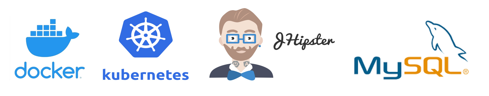
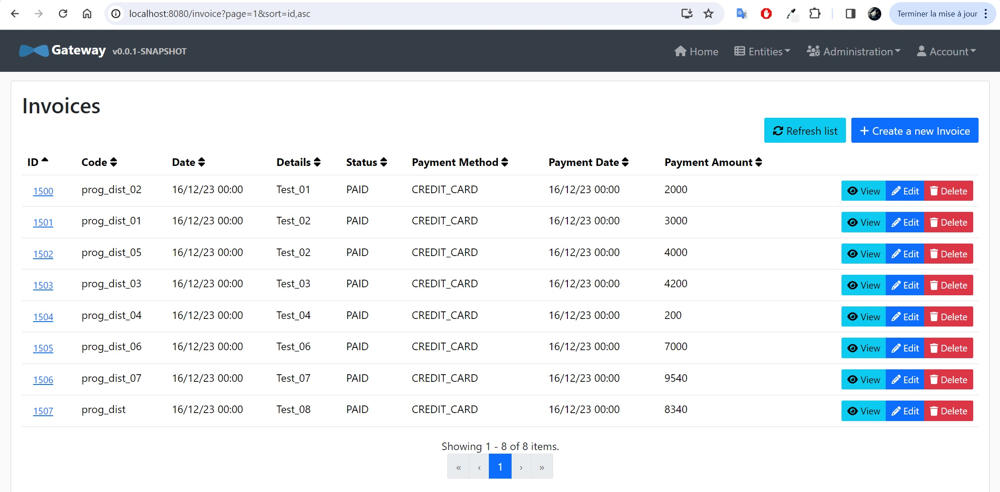
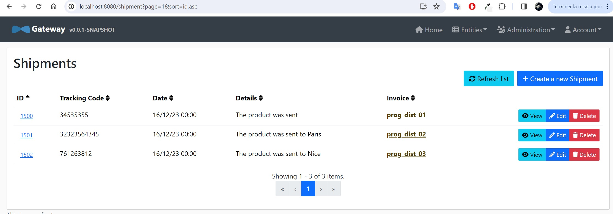

# Jhipster  :iphone: :computer:

## A Propos

Nous avons créé une application web Java avec JHipster, en utilisant l'approche MicroServices. Cette application est composée de :

- Une passerelle qui héberge également l'interface utilisateur.
- Service de facturation (qui héberge trois entités : Expédition, Commande, Facture).
- Service de révision (qui n'a pas d'entité mais sera en charge de vérifier les entités du service de facturation)

## Exigences

* Jhipster v8.1.0
* Java v17.0.9
* NodeJS v20.10.0
* MySQL v8.0.35

 

## Conditions préalables

• Docker – Vous devez vous assurer que vous accordez à Docker suffisamment de processeurs et de mémoire pour exécuter les applications (Docker -> Préférences -> Avancé). J'ai configuré 4 processeurs et 8 Go de RAM.

Référence - https://docs.docker.com/desktop/install/mac-install/

• Kubectl
Référence - https://kubernetes.io/docs/tasks/tools/

•	KIND
Référence - https://github.com/kubernetes-sigs/kind

## Run

kubectl port-forward svc/gateway 8080:8080 -n jhipster

## Information

